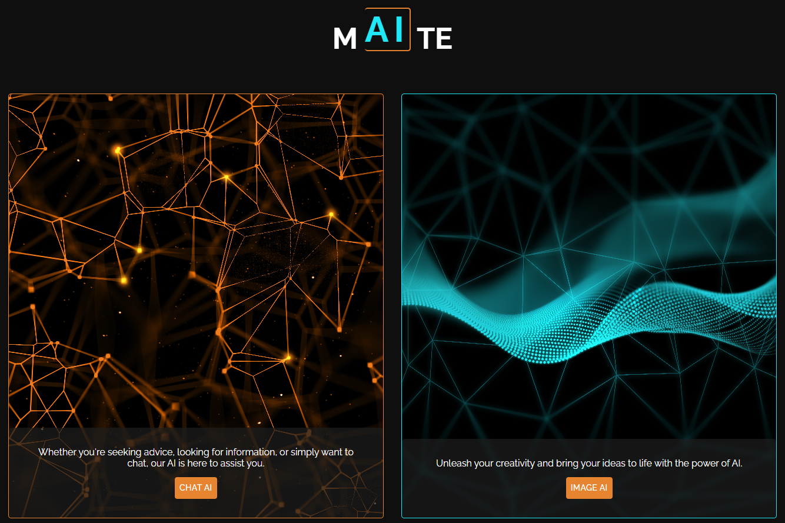

# React Portfolio

mAIte is a chatbot project developed for text generation, image generation, and motion generation. Link to deployed application: https://maite10.netlify.app/

## Description

This project has two main features:

- **Text Generation**: Generates contextually relevant text based on user inputs.
- **Still and Moving Image Generation**: Generates still and dynamic images based on specific requests.

## Table of Contents

* [Usage](#usage)
* [Code](#code)
* [Credits](#credits)
* [License](#license)

## Usage

When the user enters the website they will come across a home page presenting two main sections which they can navigate to.

The 'Projects' section displays several projects I have completed as a front-end developer, including title, screenshot, and the relevant links to visit the individual projects.

The 'Contact' section displays a form which the user can use to send me a message, and displays my relevant contact information.

## Code

The development of this application used mainly React, React Router, JavaScript, HTML, CSS, Bootstrap, JSON and Node.js. 

## Credits

I have used Google, AI, React and Bootstrap documentation to research the information I needed to complete this.

## License

Licensed under the MIT license.

# mAIte Chatbot

## Features

- **Text Generation**: mAIte utilizes advanced natural language processing (NLP) techniques to generate contextually relevant text based on user inputs.
- **Image Generation**: With mAIte, users can generate dynamic images based on specific queries or interactions.
- **Motion Generation**: mAIte incorporates innovative motion generation algorithms to create animations and dynamic visual effects.

## Technologies Used

- **React JavaScript**: The front-end of mAIte is built using React JavaScript, a popular library for building user interfaces.
- **Material-UI**: Material-UI provides a set of React components that implement Google's Material Design, ensuring a sleek and modern user interface for mAIte.
- **Node.js**: The back-end server of mAIte is powered by Node.js, a server-side JavaScript runtime known for its scalability and efficiency.
- **Axios**: Axios is used in mAIte for making HTTP requests from the front-end to the back-end server, facilitating seamless communication between client and server.

## Usage

The website is hosted via Netlify at - [https://maite10.netlify.app/](https://maite10.netlify.app/)

## Contributing

We welcome contributions from the community to enhance mAIte further. If you'd like to contribute, please follow these guidelines:

- Fork the repository.
- Create a new branch for your feature or bug fix.
- Make your changes and ensure that the code passes all tests.
- Submit a pull request detailing the changes you've made.

## License

This project is licensed under the [MIT License](LICENSE), which means you are free to use, modify, and distribute the code for both commercial and non-commercial purposes.

## Support

1. Joana Quental
2. Chris Smart
3. Avraaj Matharu
4. Theo Burton
5. Swathi Mungala
6. Ola Terry

For any questions, issues, or feedback regarding mAIte, please contact us. We're here to help!
