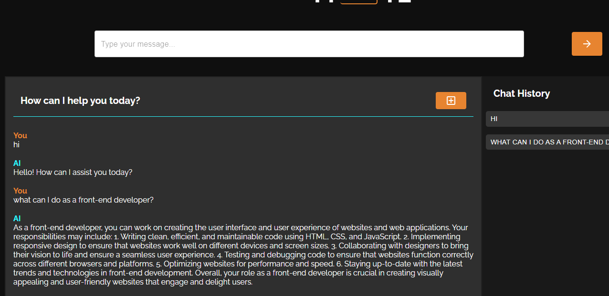
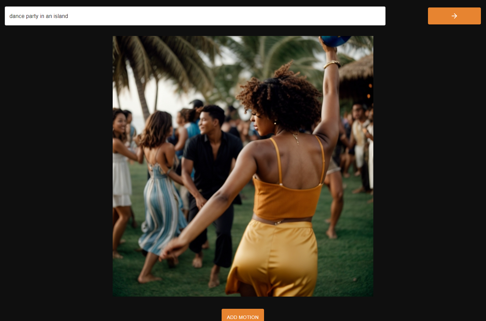

# React Portfolio

mAIte is a chatbot project developed for text generation, image generation, and motion generation. Link to deployed application: https://maite10.netlify.app/

## Description

This project has two main features:

- **Text Generation**: Generates contextually relevant text based on user inputs.
- **Still and Moving Image Generation**: Generates still and dynamic images based on specific requests.

## Table of Contents

* [Usage](#usage)
* [Code](#code)
* [Contributing](#contributing)
* [Credits](#credits)
* [License](#license)

## Usage

When the user enters the website they will come across a home page presenting two main sections which they can navigate to.

The 'Chat AI' has a text generation function, allowing the user to interact with the platform and obtain contextually relevant responses.

The 'Image AI' section has two buttons which enable the user to generate still and moving images according to their specifications.

## Code

The development of this application used mainly React, JavaScript, HTML, CSS, Material UI, Node.js, Axios and AI APIs.

## Contributing

Group project involving the contributions of the following participants:

1. Joana Quental
2. Chris Smart
3. Avraaj Matharu
4. Theo Burton
5. Swathi Mungala
6. Ola Terry

## Credits

React and Material UI documentation were used to research the desired functionalities of the application. Google searches and AI were used to support troubleshooting.

## License

Licensed under the MIT license.